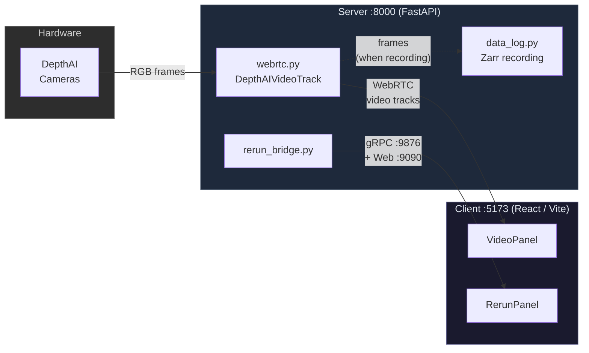
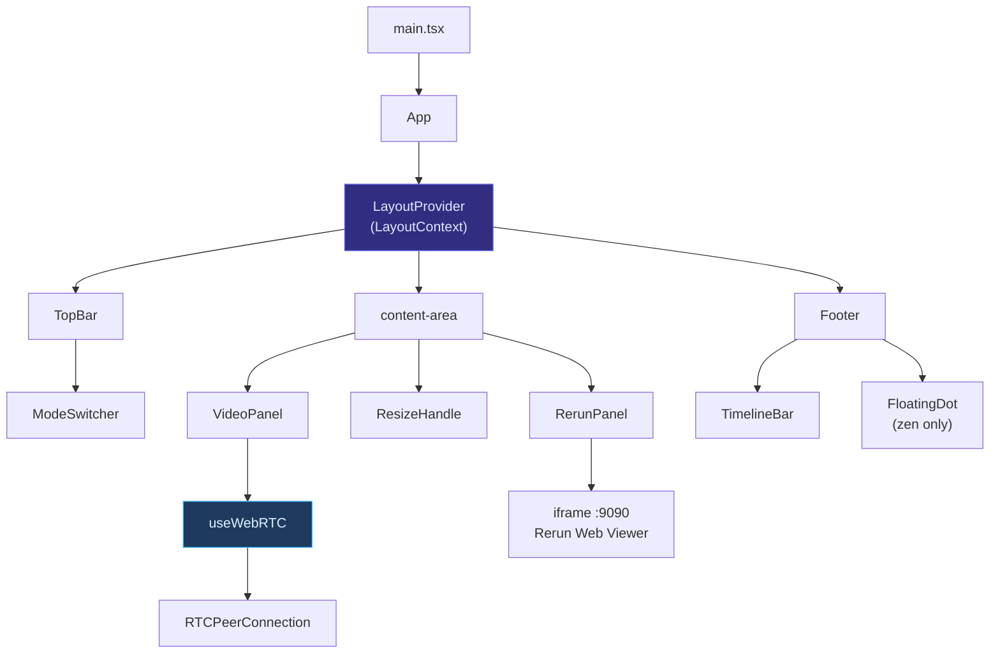
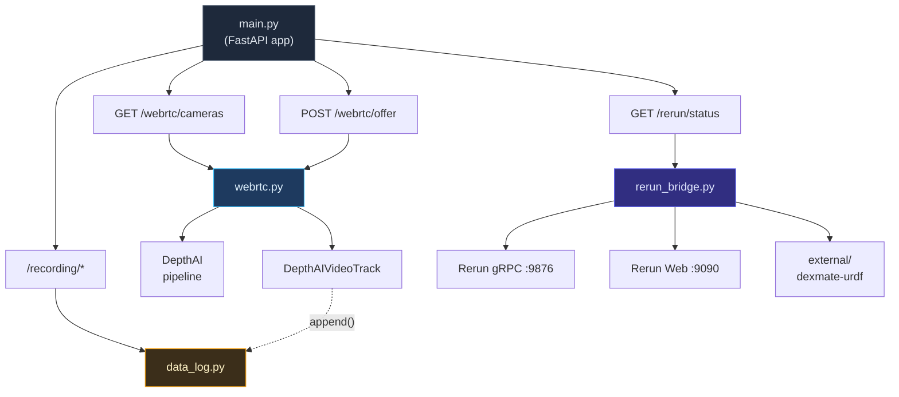
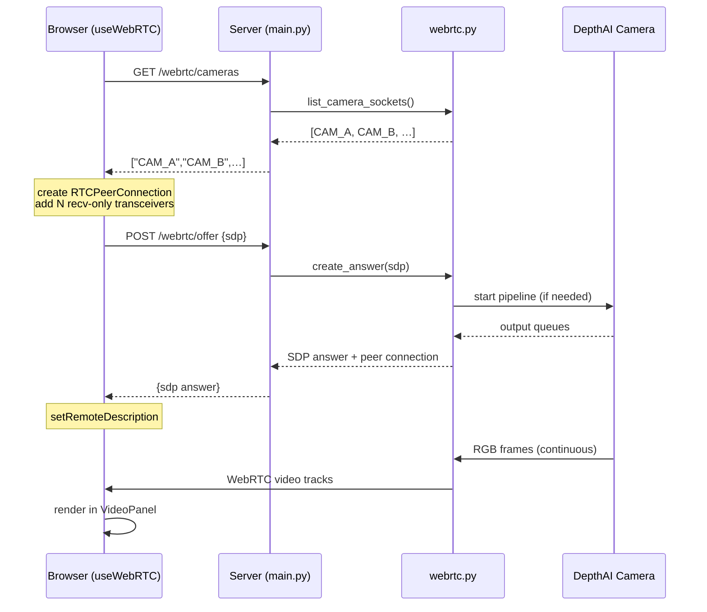

# Infrastructure and Code Structure

This document summarizes the current runtime architecture and how major components
interact in the Telemetry Console.

## Repository layout

- `client/` — React + Vite frontend (UI panels, layout state, WebRTC hook).
- `server/` — FastAPI backend (WebRTC signaling, Rerun bridge, recording).
- `tests/` — Vitest + Pytest coverage for client/server.
- `scripts/` — Dev helpers (setup, dev, lint, demos).
- `external/` — Git submodules (DepthAI SDK, Rerun SDK, URDF assets).

## Client (React/Vite)

**Entrypoint**
- `client/index.html` → `client/src/main.tsx` → `client/src/App.tsx`

**Core layout**
- `LayoutContext` holds `mode`, `focusTarget`, `splitRatio`, and keyboard shortcuts.
- `App.tsx` composes the page and conditionally shows panels based on mode.

**Panels and UI**
- `VideoPanel` mounts `useWebRTC` and renders received video tracks.
- `RerunPanel` embeds the Rerun web viewer via iframe.
- `TopBar` hosts `ModeSwitcher` plus control/status placeholders.
- `ResizeHandle`, `CompactHeader`, `FloatingDot`, `TimelineBar` provide UI chrome.

**WebRTC hook**
- `useWebRTC` fetches `/webrtc/cameras`, creates recv-only transceivers, POSTs
  the SDP offer to `/webrtc/offer`, and manages incoming tracks.

## Server (FastAPI)

**Entrypoint**
- `server/main.py` configures the app + CORS and wires endpoints.

**HTTP endpoints**
- `GET /health`
- `GET /rerun/status`
- `GET /webrtc/cameras`
- `POST /webrtc/offer`
- `GET/POST /recording/status|start|stop`

**Modules**
- `webrtc.py` — DepthAI camera discovery, aiortc peer connections, shared pipeline
  management, and `DepthAIVideoTrack`.
- `data_log.py` — Zarr-based recording manager for RGB frames + synthetic pose.
- `rerun_bridge.py` — starts Rerun gRPC + web viewer, loads URDF, sends blueprint.
- `schemas.py` — Pydantic request/response models.

## Runtime interactions

- **WebRTC**: `useWebRTC` creates an offer → `/webrtc/offer` → server builds an
  answer and attaches DepthAI tracks → client receives media in `VideoPanel`.
- **Camera discovery**: client calls `/webrtc/cameras` to decide transceiver count.
- **Recording**: when recording is active, `DepthAIVideoTrack` writes frames to
  Zarr via `RecordingManager`.
- **Rerun**: server runs gRPC on `9876` and web viewer on `9090`; client embeds
  the viewer via iframe.

## 1. System architecture

High-level view — how the three runtime layers connect.

## 2. Client component tree

## 3. Server module map

## 4. WebRTC signaling sequence

## Notes / TODOs

- `useTimeSync` and telemetry ingestion are placeholders with TODOs in code.
