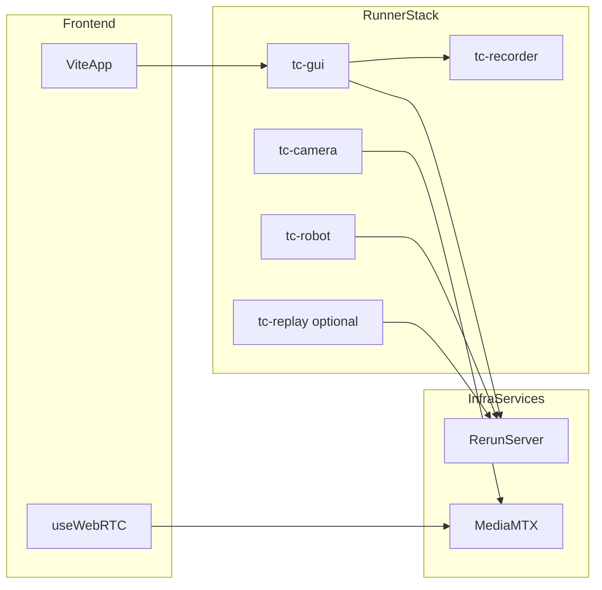
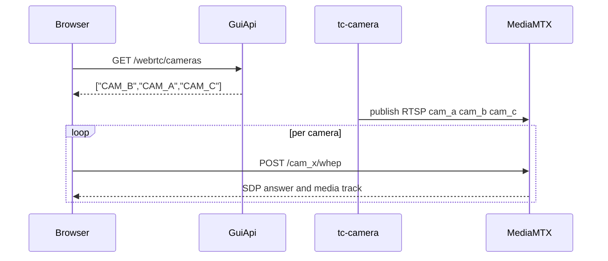

# Infrastructure and Code Structure

This document summarizes the current split-runner runtime architecture for camera
relay, recording, and visualization.

## Repository layout

- `client/` - React + Vite frontend (camera panel, layout modes, WHEP client hook).
- `server/` - backend + SDK modules.
- `server/telemetry_console/` - split runtime package:
  - `viewer.py`, `camera.py`, `env.py`, `recorder.py`, `replay.py`
  - `gui_api.py`, `cli.py`, `schemas.py`, `zmq_channels.py`
- `tests/` - Vitest + Pytest coverage.
- `scripts/` - dev orchestration, camera guards, local demos.

## Runtime services

- Frontend: `http://localhost:5173`
- GUI API: `http://127.0.0.1:8000`
- Rerun web viewer: `http://localhost:9090`
- Rerun gRPC: `rerun+http://127.0.0.1:9876/proxy`
- MediaMTX WHEP: `http://127.0.0.1:8889`
- MediaMTX RTSP ingest: `rtsp://127.0.0.1:8554`
- MediaMTX API: `http://127.0.0.1:9997`

## Split runner model

- `tc-gui` - runs Rerun viewer + FastAPI (`telemetry_console.gui_api`).
- `tc-camera` - owns DepthAI device access and publishes relay streams to MediaMTX.
- `tc-recorder` - recording service process.
- `tc-replay` - replays Zarr logs into Rerun.
- `tc-robot` - robot loop enabled by default (`RUN_ROBOT_RUNNER=0 make dev` to skip).

## API endpoints (GUI API)

- `GET /health`
- `GET /rerun/status`
- `GET /webrtc/cameras`
- `GET /recording/status`
- `POST /recording/start`
- `POST /recording/stop`

## Camera and recording flow

1. `tc-camera` discovers connected OAK sockets and starts encoded relay publishers.
2. Relay packets are forwarded to MediaMTX over RTSP (`copy` passthrough).
3. Client hook fetches `/webrtc/cameras`, then negotiates WHEP directly with MediaMTX.
4. Recording API is exposed from `tc-gui`; recorder storage is managed in runner modules.

## Development guard behavior

`make dev` keeps startup reliability checks enabled:

- pre-cleanup of stale ports/listeners
- WebRTC relay-path guard (`scripts/check_camera_live_webrtc.py`)
- GUI tile guard + snapshot (`scripts/check_camera_live_gui.mjs`)

If guards fail, startup exits non-zero.
