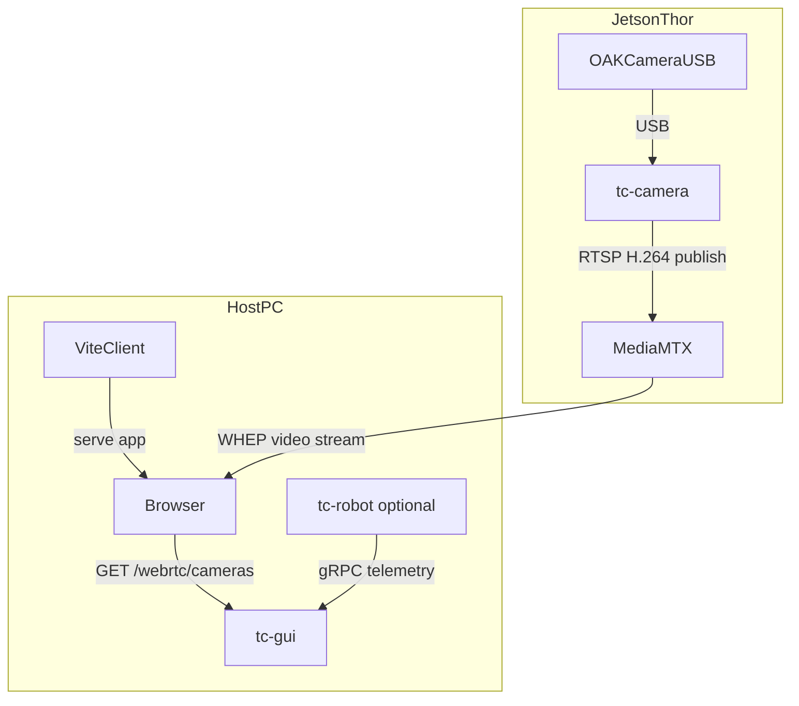
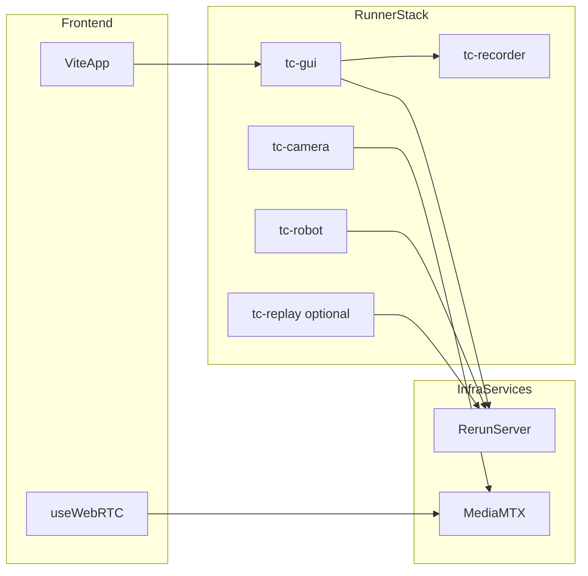
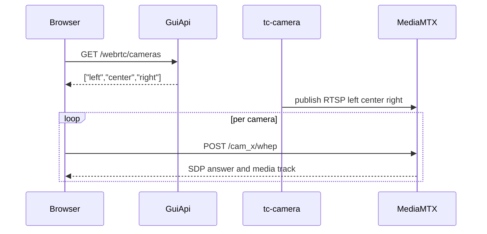

# Infrastructure and Code Structure

This document summarizes the current split-runner runtime architecture for camera
relay, recording, and visualization.

## Repository layout

- `client/` - React + Vite frontend (camera panel, layout modes, WHEP client hook).
- `server/` - backend + SDK modules.
- `server/telemetry_console/` - split runtime package:
  - `viewer.py`, `camera.py`, `env.py`, `recorder.py`, `replay.py`
  - `gui_api.py`, `cli.py`, `schemas.py`, `zmq_channels.py`
- `server/webrtc.py` - backward-compat shim (delegates to `camera.py`).
- `server/data_log.py` - `ZarrEpisodeLogger` for append-only time-series recording.
- `tests/` - Vitest + Pytest coverage.
- `tests/integration/` - Playwright integration tests (live camera rendering).
- `scripts/` - dev orchestration, camera guards, local demos.
- `docs/` - documentation, architecture diagrams, asset screenshots.
- `external/` - git submodules.
- `mediamtx.yml` - MediaMTX relay configuration (runtime-generated for multi-NIC).

## Runtime services

| Service | URL | Notes |
|---------|-----|-------|
| Frontend | `http://localhost:5173` | Vite dev server |
| GUI API | `http://127.0.0.1:8000` | FastAPI |
| Rerun web viewer | `http://localhost:9090` | |
| Rerun gRPC | `rerun+http://127.0.0.1:9876/proxy` | |
| MediaMTX WHEP | `http://127.0.0.1:8889` | WebRTC media endpoint |
| MediaMTX RTSP ingest | `rtsp://127.0.0.1:8554` | Camera ingest |
| MediaMTX API | `http://127.0.0.1:9997` | Path listing |
| MediaMTX UDP mux | `:8189` | WebRTC ICE (UDP) |

All ports are configurable via environment variables (see `.env.example`, `.env.remote.example`).

## Thor-host split profile

Use this profile when cameras are physically attached to Thor and UI runs on the host PC.

- Thor: `make setup_remote && make dev_remote`
- Host: `THOR_IP=<thor-ip> make setup_host && THOR_IP=<thor-ip> make dev_host`
- Remote cleanup helper: `make dev_remote_cleanup`



Data path notes:

1. Browser asks `tc-gui` for camera names via `GET /webrtc/cameras`.
2. Browser negotiates WHEP directly with Thor MediaMTX (`http://<thor-ip>:8889/<camera>/whep`).
3. MediaMTX streams H.264 video back to the browser.
4. `tc-gui` never proxies video payloads from MediaMTX.

## Split runner model

- `tc-gui` - runs Rerun viewer + FastAPI (`telemetry_console.gui_api`). Supports `--no-rerun` for video-only testing.
- `tc-camera` - owns DepthAI device access and publishes relay streams to MediaMTX.
- `tc-recorder` - recording service process (ZMQ-controlled).
- `tc-replay` - replays Zarr logs into Rerun.
- `tc-robot` - robot loop enabled by default (`RUN_ROBOT_RUNNER=0 make dev` to skip).



## API endpoints (GUI API)

- `GET /health`
- `GET /rerun/status`
- `GET /robot/status` - robot heartbeat check (alive, age_s, step_count)
- `GET /webrtc/cameras` - returns layout-ordered names `["left", "center", "right"]`
- `GET /recording/status`
- `POST /recording/start`
- `POST /recording/stop`

Camera name resolution: queries MediaMTX paths API (`:9997/v3/paths/list`) first, falls back to active `tc-camera` stream targets. Timeout configurable via `MEDIAMTX_PATHS_API_TIMEOUT_S` (default 0.8s).

## Camera and recording flow

1. `tc-camera` discovers connected OAK sockets and starts encoded relay publishers.
2. Relay packets are forwarded to MediaMTX over RTSP (H.264, CBR 700 kbps default).
3. Client hook fetches `/webrtc/cameras`, then negotiates WHEP directly with MediaMTX.
4. Recording API is exposed from `tc-gui`; recorder storage is managed in runner modules.

Camera ordering: `CAM_B=left`, `CAM_A=center`, `CAM_C=right`. OAK-D models get center slot priority.

Default stream parameters: 640×480 @ 30 FPS, H.264 Main profile, keyframe interval 30.



## WebRTC ICE configuration

Multi-NIC hosts are handled automatically:

- Host IP auto-detected via `ip -4 route get 1.0.0.0` (or `WEBRTC_ICE_HOST_IP` override).
- Runtime `mediamtx.yml` generated with `webrtcIPsFromInterfaces: false` and `webrtcAdditionalHosts` set to the detected IP.
- UDP mux on port 8189 (`webrtcLocalUDPAddress`).

## Development guard behavior

`make dev` keeps startup reliability checks enabled:

- pre-cleanup of stale ports/listeners (escalating SIGTERM → SIGKILL)
- WebRTC relay-path guard (`scripts/check_camera_live_webrtc.py`)
- GUI tile guard + snapshot (`scripts/check_camera_live_gui.mjs`)

If guards fail, startup exits non-zero. Bypass with `SKIP_CAMERA_GUARD=1 make dev`.

## Integration testing

Playwright integration tests run against the live stack:

```bash
make test-integration   # requires make dev running
```

Tests in `tests/integration/camera-snapshot.spec.ts`:

1. Renders three live camera tiles with labels Left / Center / Right.
2. All three streams have `readyState >= 2` and live video tracks.
3. Captures screenshot to `docs/assets/screenshots/`.
4. Validates `video.currentTime` advances (frame decode check).

Config: Chromium with H.265 feature flags, 60s timeout, serial execution.

## Split profile verification

- API health on host: `curl http://127.0.0.1:8000/health`
- Camera list on host: `curl http://127.0.0.1:8000/webrtc/cameras`
- Frontend on host: open `http://localhost:5173`
- Expected result: one live tile per camera from `http://<thor-ip>:8889/<camera>/whep`
- Wi-Fi fallback: lower remote load via `CAMERA_FPS=20` and/or lower `CAMERA_WIDTH`/`CAMERA_HEIGHT` in `.env.remote`
