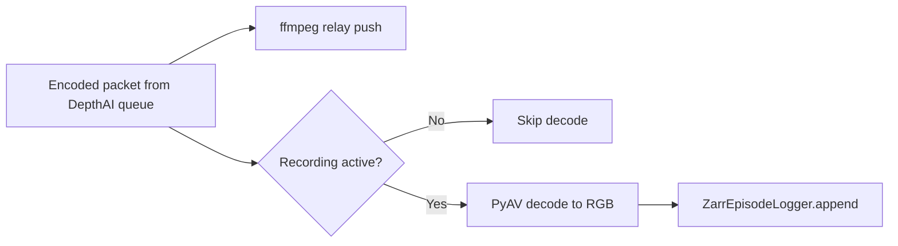
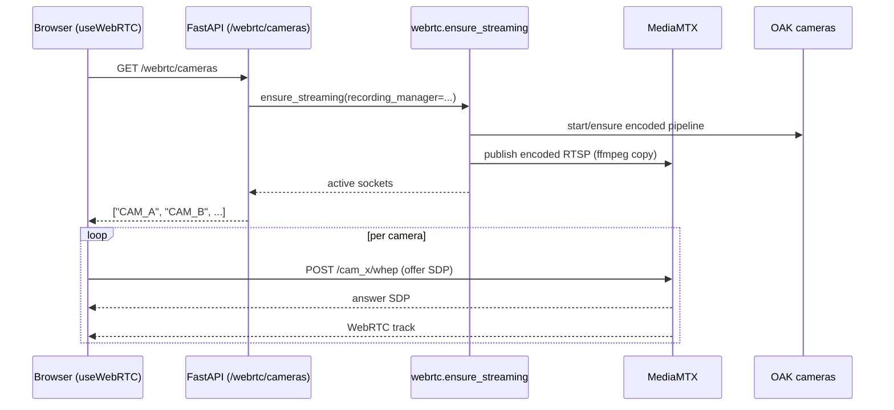

# Infrastructure and Code Structure

This document summarizes the current runtime architecture for camera relay,
recording, and visualization.

## Repository layout

- `client/` - React + Vite frontend (UI panels, layout state, WHEP client hook).
- `server/` - FastAPI backend (camera relay orchestration, recording, Rerun bridge).
- `tests/` - Vitest + Pytest coverage for client/server.
- `scripts/` - Dev helpers (setup, dev stack, camera guards, demos).
- `external/` - Git submodules (DepthAI SDK, Rerun SDK, URDF assets).

## Runtime services

- Frontend: `http://localhost:5173`
- FastAPI: `http://127.0.0.1:8000`
- MediaMTX WHEP: `http://127.0.0.1:8889`
- MediaMTX RTSP ingest: `rtsp://127.0.0.1:8554`
- MediaMTX API: `http://127.0.0.1:9997`
- Rerun gRPC: `rerun+http://127.0.0.1:9876/proxy`
- Rerun web viewer: `http://localhost:9090`

## Server endpoints

- `GET /health`
- `GET /rerun/status`
- `GET /webrtc/cameras`
- `GET /recording/status`
- `POST /recording/start`
- `POST /recording/stop`

## Camera streaming architecture (current)

The camera path is relay-only on the host:

1. DepthAI camera outputs encoded bitstream (`H264` by default).
2. Host relays encoded packets to MediaMTX via `ffmpeg -c:v copy` (no host encode).
3. Browser connects directly to MediaMTX via WHEP (`POST /<camera>/whep`).
4. Client renders one `RTCPeerConnection` per camera tile.

```mermaid
flowchart LR
  subgraph Device[OAK Device]
    ISP[Camera ISP]
    ENC[DepthAI VideoEncoder<br/>H264 default]
    ISP --> ENC
  end

  subgraph Host[Host]
    API[FastAPI<br/>/webrtc/cameras]
    RELAY[webrtc.py<br/>relay publishers]
    FFMPEG[ffmpeg<br/>-c:v copy]
    MTX[MediaMTX]
    REC[RecordingManager]
    DEC[PyAV decode tap<br/>(recording only)]
    ZARR[Zarr logs]

    API --> RELAY
    RELAY --> FFMPEG --> MTX
    RELAY --> DEC --> REC --> ZARR
  end

  subgraph Browser[Frontend]
    HOOK[useWebRTC hook]
    UI[VideoPanel grid]
    HOOK --> UI
  end

  HOOK -->|GET /webrtc/cameras| API
  HOOK -->|POST SDP offer to /cam_x/whep| MTX
  MTX -->|WebRTC media| UI
```

## Recording path

Recording is decoupled from streaming delivery:

- Streaming relay always forwards encoded packets to MediaMTX.
- When recording is active, relay publisher decodes packets with PyAV and appends
  RGB frames + timestamps into per-camera Zarr logs.
- Recording decode is host-side, but only for logging; no streaming encode occurs
  on the host.



## Client architecture

- `VideoPanel` uses `useWebRTC`.
- Hook calls `GET /webrtc/cameras`.
- Hook creates one peer connection per camera and negotiates with MediaMTX WHEP.
- Hook waits for ICE gathering completion before POSTing local SDP to reduce
  race-related negotiation failures.

## Camera connection sequence



## Notes

- Legacy `aiortc` server offer/answer signaling path is removed.
- Browser compatibility is best with `H264` default relay codec.
- `H265/HEVC` can still be enabled via relay codec config when target clients
  support it.
