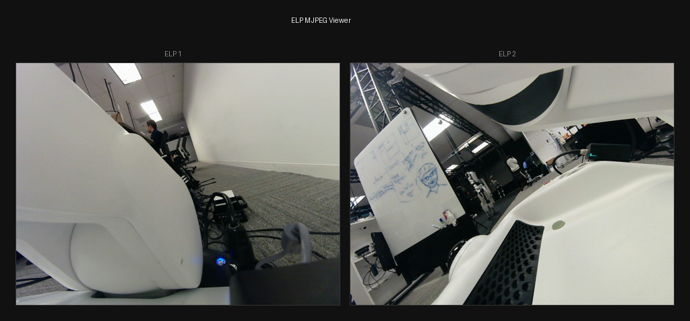

# ELP Camera MJPEG Streaming

## Goal

Stream two ELP Global Shutter USB cameras (`32e4:0234`) to the browser with lowest latency and minimum compute on Jetson Thor.

## Approach: MJPEG pass-through over HTTP

Same architecture as the OAK MJPEG debug server (`scripts/mjpeg_debug.py`, `make mjpeg`), but the capture source is V4L2/ffmpeg instead of DepthAI.

| | OAK MJPEG (`mjpeg_debug.py`) | ELP MJPEG (`mjpeg_elp.py`) |
|---|---|---|
| Capture | DepthAI queue → on-VPU MJPEG encoder | V4L2 → ffmpeg `-c:v copy` (on-sensor MJPEG) |
| Decode/encode | None (DepthAI outputs JPEG) | None (camera outputs JPEG, ffmpeg passes through) |
| Serve | FastAPI multipart HTTP | FastAPI multipart HTTP |
| Port | 8001 | 8002 |

The ELP cameras natively output MJPEG on-sensor. No decode or encode happens on the Jetson — raw JPEG bytes flow straight from V4L2 to the browser.

```
V4L2 (/dev/video8, /dev/video10)
  → ffmpeg -c:v copy -f image2pipe pipe:1   (raw JPEG pass-through)
  → Python reads stdout, splits on JPEG SOI/EOI markers
  → FastAPI StreamingResponse (multipart/x-mixed-replace)
  → Browser  tag
```

CPU cost: near zero (byte shuffling only).

## Device discovery

Scan `/dev/video*` using `udevadm info` for vendor ID `32e4` + model ID `0234`. Each physical camera creates two V4L2 nodes (capture + metadata) — group by `ID_PATH` and take the lower-numbered device per USB path. Assign names `elp_1`, `elp_2`.

## Capture pipeline

One `ffmpeg` subprocess per camera (mirrors the DepthAI queue role in `mjpeg_debug.py`):

```
ffmpeg -f v4l2 -input_format mjpeg -video_size 640x480 -framerate 30
       -i /dev/videoN -c:v copy -f image2pipe pipe:1
```

`-c:v copy` means zero decode/encode — ffmpeg demuxes V4L2 MJPEG buffers and writes raw JPEG frames to stdout. A background thread reads stdout and splits on JPEG frame boundaries (`\xff\xd8` SOI → `\xff\xd9` EOI).

## FastAPI server (port 8002)

| Endpoint | Response |
|----------|----------|
| `GET /` | HTML page with two camera tiles |
| `GET /cameras` | JSON list: `["elp_1", "elp_2"]` |
| `GET /stream/{camera}` | `multipart/x-mixed-replace` MJPEG stream |

## Configuration (env vars)

| Variable | Default | Purpose |
|----------|---------|---------|
| `MJPEG_ELP_HOST` | `0.0.0.0` | Bind address |
| `MJPEG_ELP_PORT` | `8002` | HTTP port |
| `ELP_WIDTH` | `640` | Capture width |
| `ELP_HEIGHT` | `480` | Capture height |
| `ELP_FPS` | `30` | Capture framerate |

## Files to create/modify

| File | Action |
|------|--------|
| `scripts/mjpeg_elp.py` | Create — standalone MJPEG server (modeled on `scripts/mjpeg_debug.py`) |
| `Makefile` | Add `mjpeg_elp` target |

## Run

```bash
make mjpeg_elp
# or: uv run --project server python scripts/mjpeg_elp.py
```

## Test results (2026-02-27)

**Status: PASS**

Server starts, discovers both ELP cameras, streams MJPEG over HTTP:

```
INFO mjpeg_elp: Started ffmpeg capture: /dev/video8 (640x480@30)
INFO mjpeg_elp: Opened camera: elp_1 → /dev/video8
INFO mjpeg_elp: Started ffmpeg capture: /dev/video10 (640x480@30)
INFO mjpeg_elp: Opened camera: elp_2 → /dev/video10
```

- `GET /cameras` → `["elp_1", "elp_2"]`
- `GET /stream/elp_1` → multipart MJPEG stream (~35 KB/frame)
- `GET /stream/elp_2` → multipart MJPEG stream (~50 KB/frame)
- `GET /` → HTML viewer with both camera tiles


